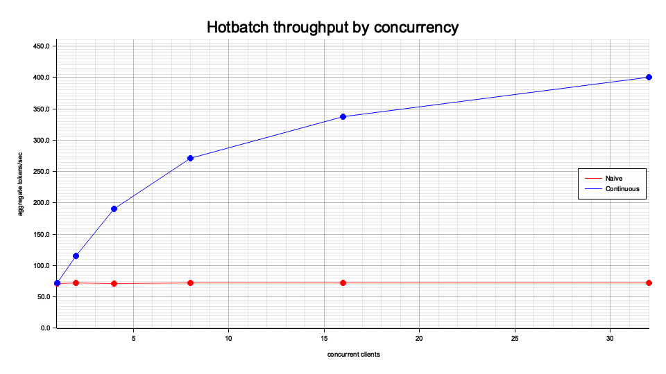
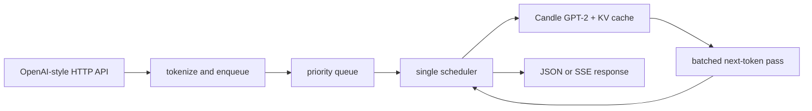

# Hotbatch

Hotbatch is a Rust inference server that runs GPT-2 with [Candle](https://github.com/huggingface/candle) on CPU and exposes an OpenAI-compatible API subset. Its continuous-batching scheduler admits requests as capacity becomes available, keeps per-sequence KV state, and advances every active sequence together in each next-token model pass.

## Benchmark

On an Apple M4 CPU with GPT-2 small, continuous batching produced **420.28 aggregate tokens/s at 32 concurrent requests**, compared with **81.11 tokens/s** for request-per-batch serving—a **5.18x throughput improvement**.

The benchmark used the same host and model for both modes, generated 64 tokens per streamed request with deterministic sampling, excluded one warm-up request per mode, and measured token arrival times from SSE frames. The complete table and methodology are in [the benchmark results](bench/results.md).



## Architecture



1. Axum handlers normalize completion or chat input and tokenize the resulting prompt.
2. The request enters a bounded priority queue shared with the scheduler.
3. The scheduler admits requests into available KV-cache slots and prefills each prompt once.
4. Every decode iteration batches one token position from each active sequence into a Candle model pass.
5. Generated tokens are sent through per-request channels; completed, cancelled, and disconnected sequences release their KV slots.

See [the architecture notes](docs/architecture.md) for component and state-management details.

## API

| Method | Endpoint | Purpose |
|---|---|---|
| `GET` | `/healthz` | Scheduler liveness |
| `GET` | `/metrics` | Prometheus metrics |
| `GET` | `/v1/models` | Configured model metadata |
| `POST` | `/v1/completions` | Text completions, returned as JSON or SSE |
| `POST` | `/v1/chat/completions` | Chat-shaped completions, returned as JSON or SSE |

Both completion endpoints accept deterministic seeds, sampling controls, stop sequences, priorities, and `stream: true`.

## Build and run

Prerequisites: Rust 1.89 or newer and a C/C++ build toolchain. The commands below run the server on `127.0.0.1:8080` by default.

The first model-backed command downloads GPT-2 tokenizer, configuration, and weight files from Hugging Face and stores them in the local cache.

```bash
cargo build --release
cargo run --release -- serve
```

In another terminal:

```bash
curl -fsS http://localhost:8080/healthz
curl -N http://localhost:8080/v1/completions \
  -H 'content-type: application/json' \
  -d '{"model":"gpt2","prompt":"Once upon a time","max_tokens":16,"stream":true,"temperature":0,"seed":42}'
```

Run the checks and benchmark with:

```bash
cargo fmt --all --check
cargo clippy --locked --workspace --all-targets -- -D warnings
cargo test --locked --release --all
cargo run --locked --release -- bench
```

## Deployment and security

The HTTP API does not implement authentication or per-client rate limiting. Keep the default loopback bind for local use. If the server is exposed beyond a trusted network, place it behind a gateway that provides authentication, request throttling, and TLS. Queue depth, sequence length, and generation length are bounded through the `serve` options.

The Docker image runs as an unprivileged user, and the Compose service drops Linux capabilities and enables a read-only root filesystem. See [SECURITY.md](SECURITY.md) for private vulnerability reporting and the supported release policy.

## Limitations

- Inference is limited to GPT-2-family models on CPU; no GPU execution path is included.
- The KV cache uses one fixed slot per active sequence rather than paged allocation or prefix sharing.
- The API implements a practical subset of the OpenAI schema, not every request field or response feature.
- Chat messages are rendered into a plain GPT-2 prompt; GPT-2 is not instruction-tuned.
- The benchmark reports one Apple M4 system and should not be generalized to other hardware or workloads.

## Contributing and license

Development setup and pull request checks are documented in [CONTRIBUTING.md](CONTRIBUTING.md). Hotbatch is available under the [MIT License](LICENSE).

## References

The scheduling and cache design is informed by [Orca](https://www.usenix.org/conference/osdi22/presentation/yu), [vLLM/PagedAttention](https://doi.org/10.1145/3600006.3613165), and [Sarathi-Serve](https://arxiv.org/abs/2403.02310). Additional notes and direct paper links are collected in [docs/papers.md](docs/papers.md).
