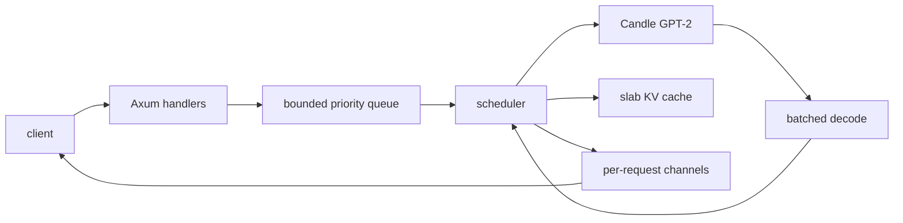

# Architecture

Hotbatch separates HTTP request handling from model execution. Axum handlers tokenize and enqueue work, while one scheduler owns the Candle model, active sequences, and KV cache. Per-request channels carry generated tokens back to streaming and non-streaming responses.



## Request flow

1. `POST /v1/completions` accepts a prompt. `POST /v1/chat/completions` first renders its messages into a GPT-2 prompt.
2. The handler tokenizes the prompt, creates the sampling and stopping state, and submits the request to the bounded queue.
3. The queue selects the highest-priority request; equal-priority requests retain arrival order.
4. When a sequence slot is available, the scheduler allocates KV state and runs prompt prefill.
5. The scheduler builds a decode batch with one current token from every active sequence and executes one model forward pass.
6. Each sampled token updates its sequence state and is sent through that request's channel.
7. Reaching a terminal condition or losing the receiver removes the sequence and returns its KV slot.

## Ownership and concurrency

The scheduler is the only component that mutates model and KV state. HTTP tasks communicate with it through the request queue and receive results through bounded Tokio channels. This ownership boundary avoids concurrent mutation of model state while allowing independent HTTP connections to stream results.

The active batch is rebuilt for every decode iteration. New requests can join when slots become available, and finished or disconnected requests leave before the next iteration. Batch membership therefore changes without waiting for all sequences in an earlier batch to finish.

## KV cache

The cache maintains a fixed number of sequence slots. Each allocated slot stores key and value tensors by transformer layer, with token capacity bounded by the prompt and generation allocation:

```text
sequence slot -> layer -> (key tensor, value tensor)
                           [heads, tokens, head dimension]
```

Prefill populates the prompt state, and each decode pass appends the next position. Slot release removes the stored tensors and makes the slot available to another request. The cache does not implement paging, prefix sharing, or eviction.

## Serving modes

Continuous mode uses the shared scheduler described above. Naive mode executes each request independently and exists as the benchmark baseline. Both modes expose the same HTTP routes and response formats.
